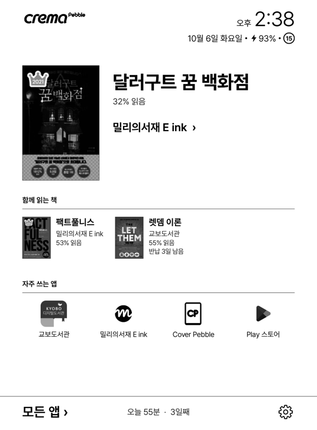
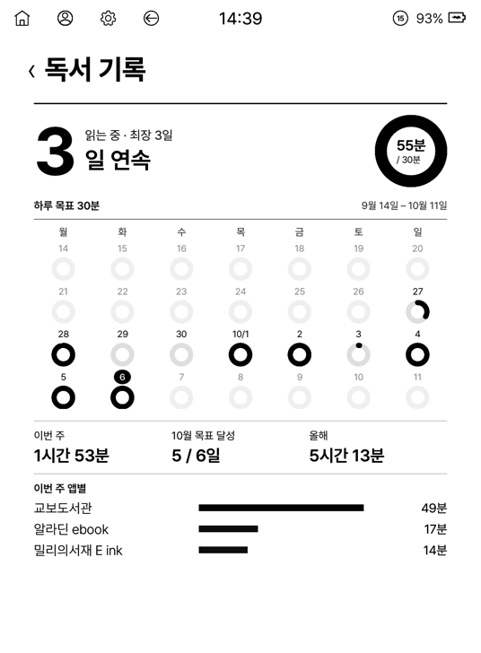
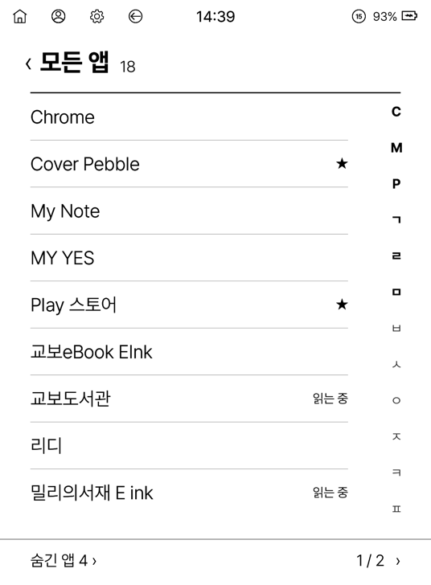
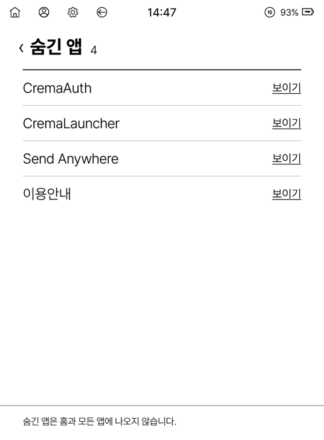
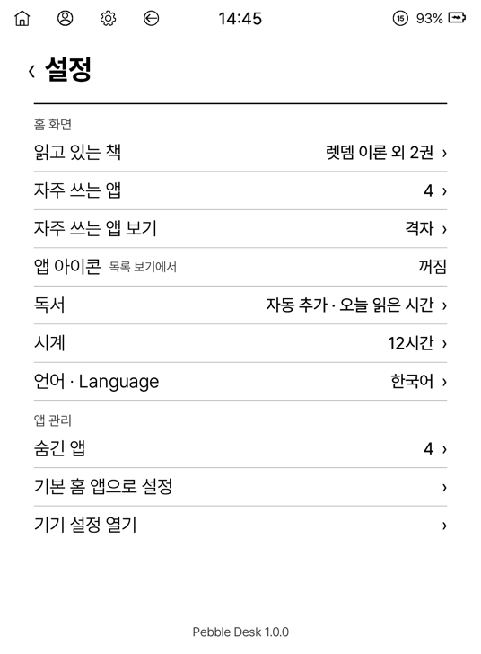

# Pebble Desk

크레마 페블 같은 6인치 전자잉크 기기를 위한 글자 중심 홈 앱(런처).
지금 읽는 책을 가장 크게 두고, 나머지는 자주 쓰는 앱과 모든 앱으로 나눈다.

- 흑백·박스 없음·애니메이션 없음. 목록은 스크롤 대신 페이지로 넘긴다.
- 바뀐 곳만 다시 그려 화면 깜빡임을 줄인다.
- 기기가 잠금 해제되기 전에도 바로 뜬다(부팅 화면 직후 홈).

| 홈 | 독서 기록 | 모든 앱 | 숨긴 앱 | 설정 |
|---|---|---|---|---|
|  |  |  |  |  |

## 지원 기기

| 기기 | 상태 |
|---|---|
| **크레마 페블** (YES24, 6인치 1072×1456) | 개발·확인하는 기본 기기. 모든 기능이 된다. |
| **Meebook E6** (Haoqing, 6인치 1072×1448) | 1.2.1 부터. 홈·설정·기기 정보 화면과 빠른 설정 열기를 실제 기기 사진으로 확인했다. 페이지 버튼으로 쪽 넘기기는 아직 확인하지 못했다. 상단 로고는 없고, 시스템 글꼴(명조)에 따라 글자 모양이 페블과 다르다. |
| **Viwoods AiPaper Mini** (SE05, 8.2인치 1440×1920) | 1.2.1 부터. 홈·기기 정보 화면을 실제 기기 사진으로 확인했다(책·자주 쓰는 앱·오늘 읽은 시간, 자동 추가 켜짐). 빠른 설정은 원래 기기처럼 화면 오른쪽 위에서 손가락으로 끌어내려 연다(홈 상단 줄을 눌러서는 열리지 않는다). 상단 줄의 조명 표시는 아직 없다. 상단 로고는 없고, 화면이 커서 글자·줄이 페블보다 1.4배쯤 크게 보인다. |

| **iReader Ocean 5 Pro** (掌阅, 7인치 1264×1680, 안드로이드 14) | 1.3.0 부터. 홈·기기 정보 화면을 실제 기기 사진으로 확인했다(오늘 읽은 시간 쌓임). 파일(APK)로 설치하면 안드로이드가 접근성을 '제한된 설정'으로 막아, 자동 추가를 켜려면 앱 정보 › ⋮ › 제한된 설정 허용이 필요하다([시작하기](#처음-설치하면-시작하기)가 단계별로 안내한다). 옆 페이지 버튼은 음량 키로 들어와 Pebble Desk 목록은 넘기지 못한다. 상단 로고는 없다. |

화면 규격은 페블(폭 572dp) 기준으로 만들고, 다른 기기는 폭이 같아지도록 앱이 밀도를 맞춘다. 그 밖의 안드로이드 전자잉크 기기에서도 뜨지만 확인하지 않았다. 다른 기기에서 문제가 있으면 설정 > `기기 정보` 화면을 사진으로 찍어 보내 주면 맞춘다. 기기별 조사는 [docs/DEVICES.md](docs/DEVICES.md).

## 처음 설치하면 (시작하기)

홈이 처음 뜰 때 **시작하기** 두 쪽이 한 번 나온다. 이 앱의 기본 기능인 두 가지를 켜게 한다(둘 다 이미 켜져 있으면 나오지 않는다).

1. **읽는 책 자동 추가**(1/2): 무엇이 되는지와 켜면 홈에 생기는 모습, `켜는 방법` 단계와 그 시스템 화면을 여는 버튼(`접근성 열기 ›`). 안드로이드 13 이상은 파일로 깐 앱이 막혔을 때 푸는 단계(`제한된 설정` 창 닫기 → `앱 정보 열기 ›` › ⋮ › 제한된 설정 허용 → 다시 켜기)까지 보인다. 켜져야 `다음 ›` 이 눌린다.
2. **오늘 읽은 시간**(2/2): 같은 모양으로 `사용 기록 액세스` 를 허용하게 한다. 켜져야 `시작하기 ›` 가 눌린다.

그만두려면 뒤로 키. 다시 나오지 않으며, 나중에는 설정 › 독서에서 켜고 끈다.

## 홈 화면

위에서부터 네 구역으로 나뉜다.

1. **상단 두 줄**: 크레마 로고(페블만)·시계, 그 아래 상태 줄(`10월 3일 토요일 · 100% · 와이파이 · BT · 조명 · ⑮`).
   - 와이파이·블루투스·조명은 켜져 있을 때만, 충전 중이면 배터리 앞에 번개 표시, 마지막 원문자는 잔상 제거 횟수.
   - 누르면 기기의 빠른 설정(와이파이·BT·조명·음량)이 열린다(크레마 빠른 설정 / 메이북 빠른 설정 패널).
2. **지금 읽는 책**: 표지·제목·저자·진행률(`47% 읽음`)·반납일(`반납 4일 남음`)과 그 책을 읽는 앱. 누르면 그 앱이 열린다.
   - 책은 최대 10권, 홈에는 앞 4권이 보인다. 맨 앞 책이 크게, 다음 3권은 `함께 읽는 책` 줄에 작은 표지로 보인다. 작은 표지를 누르면 그 책이 맨 앞으로 오고 앱이 열린다.
   - 책이 없으면 회색 자리 표시(스켈레톤)가 보이고, 누르면 책 추가로 간다.
3. **자주 쓰는 앱**: 직접 고른 앱을 직접 정한 순서로. 목록(3줄) 또는 격자(4×2) 보기. 넘치면 `‹ 1 / 2 ›` 로 쪽을 넘긴다.
4. **하단 줄**: `모든 앱 ›` · 오늘 읽은 시간(`오늘 42분 · 5일째`) · 설정.

앱이나 책을 길게 누르면 아래에서 메뉴가 올라온다.

- 앱: 자주 쓰는 앱에 넣기·빼기, 숨기기, 앱 정보
- 책: 완독, 책 정보 고치기(읽고 있는 앱 바꾸기 · 제목 · 저자 · 표지 다시 찾기), 책 빼기(완독·책 빼기는 실수로 누르지 않게 `완독 / 취소`, `책 빼기 / 취소`로 한 번 더 묻는다). 올해 읽은 책에서 책을 누를 때와 같은 상세로, 머리에 표지·저자·앱·진행률과 지금 읽는 기록

## 모든 앱

- 숨긴 앱을 뺀 모든 앱을 가나다순으로 페이지에 나눠 보여 준다. 오른쪽 색인 글자를 누르면 그 글자로 간다.
- 자주 쓰는 앱은 `★`, 책에 연결된 앱은 `읽는 중` 으로 표시한다.
- 숨긴 앱은 따로 모아 보고 다시 보이게 할 수 있다.
- 앱 아이콘은 흑백으로 바꿔 작게 붙인다(설정에서 끄면 이름만).

## 읽고 있는 책

### 직접 추가

제목을 입력하면 YES24에서 표지를 찾아 보여 준다. 표지를 고르고, 그 책을 읽는 앱을 고르면 홈에 들어간다.
읽고 있는 책 목록에서 순서를 바꾸거나 빼고, 앱을 바꿀 수 있다.

### 완독

책 메뉴의 `완독`을 누르면 읽고 있는 책에서 빠지고 완독한 책으로 남는다(그날을 완독한 날로). 완독한 책은 [올해 읽은 책](#올해-읽은-책)에 표지에 `완독` 띠를 두르고 보이고, 이북 앱에서 다시 열어도 자동 추가가 다시 넣지 않는다(다시 읽으려면 `다시 읽기`). `책 빼기`로 뺀 책도 기록은 남아, 읽은 시간이 있으면 올해 읽은 책에 보인다.

### 자동 추가 (설정 > 독서)

이북 앱의 서재에서 책을 누르거나 읽는 화면을 열면, 그 책을 홈 맨 앞으로 자동으로 넣는다. 안드로이드 접근성에서 Pebble Desk 를 켜면 켜진 것이다(설정 › 독서의 `켜짐`/`꺼짐` 은 접근성 상태 그대로이고, 누르면 안내 창에서 접근성을 연다).

> 안드로이드 13 이상에서 APK 파일로 설치하면 접근성의 Pebble Desk 가 흐리게 막힐 수 있다(제한된 설정, Play 스토어로 깐 앱은 해당 없음). Pebble Desk 를 한 번 눌러 안내 창을 닫은 뒤, 앱 정보(설정 › 독서 › 읽는 책 자동 추가 › `앱 정보 열기`) › 오른쪽 위 ⋮ › **제한된 설정 허용** 을 하고 다시 켠다.

- 지원하는 앱: 교보도서관 · 교보eBook · 밀리의서재 · 알라딘 · 북커스 · 리디 · YES24(전자도서관 · my YES) · 문리더
- 서재·읽는 화면에 보이는 정보로 **제목·저자·진행률·반납일**을 채운다. 진행률은 뷰어 설정에서 화면 아래 정보(진행률·쪽)를 켜 두면 읽는 중에도 갱신된다.
- 표지는 서재 화면에서 그 책 칸의 그림을 잘라 온다. 가져올 수 없으면 제목·저자를 넣은 **빈 표지**를 그리고, `표지 다시 찾기` 로 YES24 표지를 고를 수 있다.
- 10권이 차 있으면 새 책은 넣지 않는다(목록에서 한 권을 빼면 다시 들어온다). 완독한 책도 다시 넣지 않는다.
- 접근성 서비스는 위 이북 앱 화면만 받는다. 다른 앱의 화면은 보지 않는다.

앱마다 되는 것과 안 되는 것은 설정 > 독서 > `자동 추가 안내`와 [docs/READER_APPS.md](docs/READER_APPS.md)에 있다.

> 이북 앱이 특정 책을 바로 열어 주지는 않으므로, 책을 누르면 그 앱이 열린다.

## 독서 기록 (설정 > 독서)

이북 앱의 **읽는 화면**이 떠 있던 시간을 세어 하루 읽은 시간을 보여 준다. 안드로이드 **사용 기록 액세스**에서 Pebble Desk 를 허용하면 켜진 것이다(설정 › 독서 › 오늘 읽은 시간이 그 화면을 연다).

- 서재·스토어 화면과 화면이 꺼진 시간은 세지 않는다.
- **책별로 센다**: 읽는 책 자동 추가(접근성 서비스)가 그 앱에서 편 책을 알아 두고, 읽는 화면 시간을 그 앱에서 마지막으로 편 책으로 나눈다. 어떤 책인지 한 번도 몰랐던 앱의 시간은 합계에만 들어간다.
- 하단 줄에 `오늘 42분 · 5일째`(연속일 = 하루 1분 이상 읽은 날이 이어진 수).
- 누르면 **독서 기록** 화면:
  - 연속일·최장 기록, 이번 달 목표 달성 일수(`10월 목표 달성 7 / 8일`), 오늘의 목표 링(`5분 / 30분`)
  - 4주 링 달력(날마다 하루 목표 대비) 또는 막대그래프(날마다 읽은 시간, 목표선). `달력 · 그래프`로 바꾸고, `‹ ›`로 4주씩 지난 기간을 넘겨 본다.
  - 읽은 시간(이번 주 · 이번 달 · 올해)과 **이번 주 읽은 책**(책 이름 · 시간, 다섯 권씩 쪽 넘기기)
  - 제목 오른쪽 `올해 읽은 책 ›`
- 하루 목표(없음 / 15분~1시간 / 직접 입력 1~300분, 기본 30분. 바꿔도 지난날은 그날의 목표로)와 한 주 시작 요일(월·일)을 고를 수 있다.
- 처음 켤 때 사용 기록에서 7일 전까지 채운다. 기록은 지우지 않고 계속 남는다.

### 올해 읽은 책

그해 읽었거나 완독한 책을 모두 모아 보여 준다(읽는 중 · 완독한 책 · 뺀 책 · 목록에 넣지 못한 책).

- 목록(표지 · 제목 · 저자) 또는 표지 격자(한 줄에 4권). 아래 `전체 · 완독`으로 그해 완독한 책만 볼 수 있다. 완독한 책은 표지 모서리에 `완독` 띠, 목록 줄과 상세에는 둥근 `COMPLETED` 도장.
- 책을 누르면 홈의 책 메뉴와 같은 머리(표지·저자·앱)와 회차마다 읽은 기간(`9월 2일 – 10월 6일`)·읽은 시간, 메뉴(`완독` · `다시 읽기` · `책 정보 고치기` · `기록에서 지우기`, 읽고 있는 책이면 홈과 같은 메뉴). 다 읽은 책도 제목·저자·표지를 고칠 수 있다. 완독한 책을 `다시 읽기`해도 완독 기록은 남고, 다시 완독하면 `1회`·`2회`처럼 회차마다 기간이 쌓인다.
- 제목 오른쪽 `2026 ▾`으로 지난해를 고른다(`2025년 읽은 책`).

## 설정

| 묶음 | 항목 |
|---|---|
| 홈 화면 | 자주 쓰는 앱 관리, 보기(목록/격자), 읽고 있는 책, 앱 아이콘, 시계(24시간/12시간), 언어(한국어/English) |
| 독서 | 읽는 책 자동 추가, 자동 추가 안내, 오늘 읽은 시간, 하루 목표, 한 주 시작, 독서 기록 |
| 앱 관리 | 숨긴 앱, 기본 홈 앱으로 설정, 기기 설정 열기, 기기 정보(모델·화면·권한·누른 버튼·빠른 설정 시험을 한 화면에 모은 진단 화면) |

## 권한

| 권한 | 쓰는 곳 |
|---|---|
| 앱 목록 조회 | 모든 앱·자주 쓰는 앱 |
| 인터넷 | 책 추가·표지 다시 찾기의 YES24 검색 |
| 와이파이·블루투스 상태 | 상단 상태 줄 |
| 사용 기록 액세스 (선택) | 오늘 읽은 시간·독서 기록 |
| 접근성 서비스 (선택) | 읽는 책 자동 추가 |

## 데이터

앱 데이터는 기기 안에만 둔다(밖으로 보내지 않는다). 읽은 시간·편 책·읽고 있는 책·완독한 책은 앱 DB(SQLite), 표지는 파일, 설정은 앱 설정 파일. 예전 버전의 기록 파일은 처음 실행할 때 DB로 옮긴다. 앱을 지우면 기록도 지워진다.

## 빌드·설치

Android Studio의 JDK로 빌드한다(minSdk 28, targetSdk 34).

```bash
export JAVA_HOME="/Applications/Android Studio.app/Contents/jbr/Contents/Home"
./gradlew assembleRelease
adb install -r app/build/outputs/apk/release/PebbleDesk-1.3.1-release.apk
```

설치한 뒤 설정 > 앱 관리 > `기본 홈 앱으로 설정`에서 Pebble Desk를 홈 앱으로 고른다.

## 문서

- [DESIGN.md](DESIGN.md): 화면 규격과 동작의 기준
- [docs/READER_APPS.md](docs/READER_APPS.md): 이북 앱별로 알아낼 수 있는 것과 없는 것
- [docs/DEVICES.md](docs/DEVICES.md): 기기별 호환 조사(크레마 페블, Meebook E6, Viwoods AiPaper Mini, iReader Ocean 5 Pro)

## 라이선스

[PolyForm Noncommercial 1.0.0](LICENSE). 개인 용도(취미·공부·연구)와 비영리 단체(학교·공공기관·자선 단체 등)는 자유롭게 쓰고, 고치고, 나눌 수 있다. 나눌 때는 이 라이선스와 `Required Notice` 줄을 함께 전한다.

상업적 이용(판매, 유료 제품·서비스에 넣기, 회사의 영리 업무에 쓰기 등)은 허용하지 않는다. 필요하면 [GitHub 이슈](https://github.com/hissinger/pebble-desk/issues)로 따로 문의한다.

완독 도장 그림(`app/src/main/res/drawable-nodpi/stamp_completed.png`)은 위 라이선스가 아니다. Pixabay의 [TheDigitalArtist 'Approved Stamp'](https://pixabay.com/illustrations/approved-stamp-approval-business-5254258/)([Pixabay Content License](https://pixabay.com/service/license-summary/))를 고친 것이다(가운데 글자를 `COMPLETED`로, 흑백, `tools/stamp_completed.py`).

시작하기 화면의 예시 책 표지(`app/src/main/res/drawable-nodpi/sample_cover.jpg`)는 윤동주 『하늘과 바람과 별과 시』(정음사, 1948) 초판 표지로, 국립한글박물관 아카이브의 스캔을 Wikimedia Commons 에 올린 [퍼블릭 도메인 파일](https://commons.wikimedia.org/wiki/File:%EC%9C%A4%EB%8F%99%EC%A3%BC_%ED%95%98%EB%8A%98%EA%B3%BC_%EB%B0%94%EB%9E%8C%EA%B3%BC_%EB%B3%84%EA%B3%BC_%EC%8B%9C_(%EC%B4%88%ED%8C%90%EB%B3%B8,_1948).pdf)을 흑백으로 줄인 것이다(`tools/sample_cover.py`).
